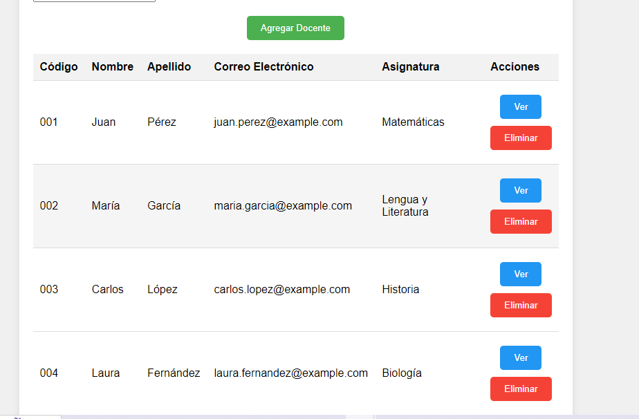

# [PROYECTO DE GESTIÓN DOCENTE]

*Repositorio para el curso de experiencia formativa en sitio real de trabajo  CERTUS*

* Se relizó un sistema gestión docente para este proyecto usando html, css y javascript
* y también se uso bizagui para la  modelación de los procesos para realizar el proyecto.

## Instalación

* Clonar el repositorio con  git clone.
* Levantar el proyecto en su servidor local

## Vista del proyecto

 

### Integrantes

* *Edwin Samuel Diego Juarez*
 
* *Luis David Quispe*
* *Eddy Ruiz Litano*